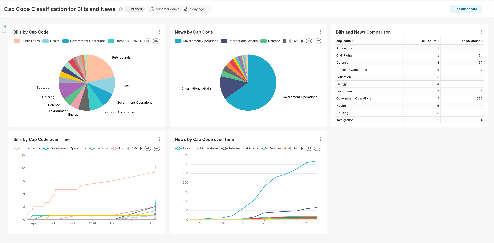

# Political Bills and Media Analysis Pipeline

## Project Description

EDIT: As the huggingface models I was using [are no longer usable by the public](https://huggingface.co/poltextlab/xlm-roberta-large-english-legislative-cap-v3), I cannot continue with ingesting data. The license I chose to use for this project is more permissible: if you are anyone and want to use this pipeline and have access to the HF models in question, then please read the LICENSE for exact restrictions.

Is there a difference in what senators and representatives are discussing in Congress and what is being discussed in the news? The best way to answer that is by collecting immense amounts of data from both sources, classifying topics, and comparing the overall landscape of what each group is discussing.

This is project ingests congressional data from the [Library of Congress's API]([https://api.data.gov/docs/developer-manual/]) and political news from a Google News rss feed and then classifies those data's policy areas with a [pretrained Huggingface model](https://huggingface.co/poltextlab/xlm-roberta-large-english-legislative-cap-v3) that uses the [Comparative Agendas Project's (cap)](https://www.comparativeagendas.net/us) schema. The data is loaded into a PostGreSQL database daily, which is then connected to a [Superset](https://superset.apache.org/) instance for data analysis.

### Credits
Inspiration for this project comes from research I assisted in while in undergrad under the supervision of Beth Leech and Greg Lyon:

* McKay, Amy, Beth L. Leech, Adam Chalmers, Patrick Bernhagen, and Joost Berkhout. nd. "What Matters: Public and       Private Agendas in Cross-National Perspective," unpublished manuscript, University of Exeter

## TODO:

- [ ] enum everywhere
- [ ] Write unit tests

## (Some) Documentation

Upon initial startup, the following `constants.py` file will be created with the option of inputting values.

```python
db_config = {
    "HOST" : 'host',
    "DBNAME" : 'dbname',
    "USER" : 'user',
    "PASSWORD" : 'password' 
}

CONGRESS_API_KEY = 'congress_key'
```

Two tables that will be created in your database with the following schemas:

```sql
Table bill {
  number integer pk
  title text
  url text
  cap_code text
  committees text[]
  policy_area text
  bill_type text
  congress integer 
  introducedDate date
}

Table news {
  article_id text pk
  title text
  url text
  source text
  pub_date timestamptz
  description text
}
```

## Analysis of Project

Other than minor technical nitpicks (what's test coverage?), I would say that this project is ultimately complete. Getting more data than what I already have won't soon get me a better answer to the question I initially asked, for reasons I'll get into below. I learned a lot, however, from a purely technical programming aspect as well as learning more about HuggingFace, databases, xmls and rss feeds, and a couple of other things.

### Issues

#### Quality of Data Sources

Getting media news data has been a struggle since the first day of this project. While there are many news APIs, such as newsapi, perignon, and newscatcher, they all, reasonably, cost money to use, which I didn't want to spend. I figured that the next best thing would be to recreate those APIs by going directly to the source -- the rss feeds that I assumed that all these APIs used to populate their databases. Unfortunately, as [newscatcher](https://www.newscatcherapi.com/blog/top-4-free-and-open-ource-news-api-alternatives) themselves point out, any news site can shut down their rss feed without notice, which is exactly what some of the news sites that I explored did.

I decided to use Google News' rss feed functionality, but there were major drawbacks: I couldn't scrape the html itself because of paywalls, which meant that the only text data I had for each article was its title.

A similar issue arose with the Library of Congress's API. The Library exposes bills, etc. data before they have been transcribed into text. That is, sometimes only scans of the original bills are present, which, again, means that I don't have much text data for each bill.

While this is an important limitation to point out, I found that it actually didn't impact cap code labeling as much as I thought it would. The only arguably incorrect labels had to do with recent hurricane relief. While I would personally label those topics as 'Environment', the model opted to label them as 'Domestic Commerce'. That does make sense, it just doesn't make as much sense as 'Environment' does to me.

#### Quality of Data

Starting this project in September 2024 was an awful idea: with national elections right around the corner, a lot of the news is about Trump and Harris. Rightly so, sure, but ultimately, most of that data isn't relevant for this project. Trump calling CBS's editing of Harris's interview a scandal, or a review of San Francisco's brutal politics' shaping of Harris's politics, isn't really actionable data. On the other hand, Harris's criticism of Trump's "playing politics" with hurricane disaster relief is. Its hard to filter out data in such a way that isn't inherently biased: even a statement like

```sql
SELECT * FROM news
WHERE
    description NOT SIMILAR TO '%(Trump|Harris)%'
AND
    cap_code NOT LIKE 'Government Operations'
```

will likely remove too much. For instance, if Trump starts talking about voter fraud again, that would be filtered out with this statement even though I'd want to see that in the results.

I found that about 57% of all rows were labeled `Government Operations`, most of which had to do with the election. Drilling down, about 34% of all media articles and 7.5% of all bills were labeled as such. To compare, in 2015, about 9% of all US bills and about 9% of the NYT front page were related to Government Operations, according to the [Comparative Agendas Trend Tool](https://www.comparativeagendas.net/tool) (2015 is the last full year of data on the site.)

```sql
with
  cte as (
    select
      (
        select
          sum(bill_count + news_count)
        from
          cap_code_pivot
        where
          cap_code like 'Government Operations'
      ) as gov_op_count,
      sum(bill_count + news_count) as total_count
    from
      cap_code_pivot
  )
select
  gov_op_count, total_count, round((gov_op_count / total_count), 2) as gov_op_fraction
from
  cte
```

| gov_op_count | total_count | gov_op_fraction |
| ------------ | ----------- | --------------- |
| 159          | 281         | 0.57            |

### Things Learned

Postgres, HuggingFace, Better Python.

#### Postgres

This project unfortunately didn't get to use any particularly interesting aspects of Postgres, other than maybe its more robust handling of text data over the SQL standard VARCHAR(255). Still, I learned a bit of database admin when I tried spinning up my own local server to connect to, and had an excuse to use [Supabase](https://supabase.com/) when I realized that that was the much better route and fit perfectly for my needs.


#### HuggingFace

I'm grateful that the [poltextlab](https://poltextlab.com/) decided to train text classification models on this domain and made them publicly available on HuggingFace. And I'm grateful that HuggingFace's transformers library is so easy to use. If it weren't for these models, I would have used a random text generation model to act as a text classifier, which likely would've been much less accurate. I'm also glad I didn't have any reason to consider fine tuning my own model on my personal laptop with no GPU.

#### Better Python

A lot of the bigger struggles with this project was deciding where certain functions should live. For instance, I had a class that managed all database functionality and classes that managed Bill and News data. Should a function that sends Bill or News data to the database live in the former or the latter? I decided to keep it in the latter because it didn't make sense for the database manager to know anything about the structure of a Bill or News, but the tradeoff was that the Bill and News classes knew a bit too much about what a SQL statement looks like than I would ideally like. These questions are tough, but I think I made my codebase as maintainable and extensible as possible.

### Conclusion

I said that I will wrap up this project soon, but I will likely revisit after the elections. It would be nice to have better news data, but as previously mentioned, the models already do a great job. Overall, though, while I wouldn't call this project a complete success, I am glad that I did this and am excited to apply what I learned in other projects.

### Current Analytics

A screenshot of my superset dashboard at the moment:

